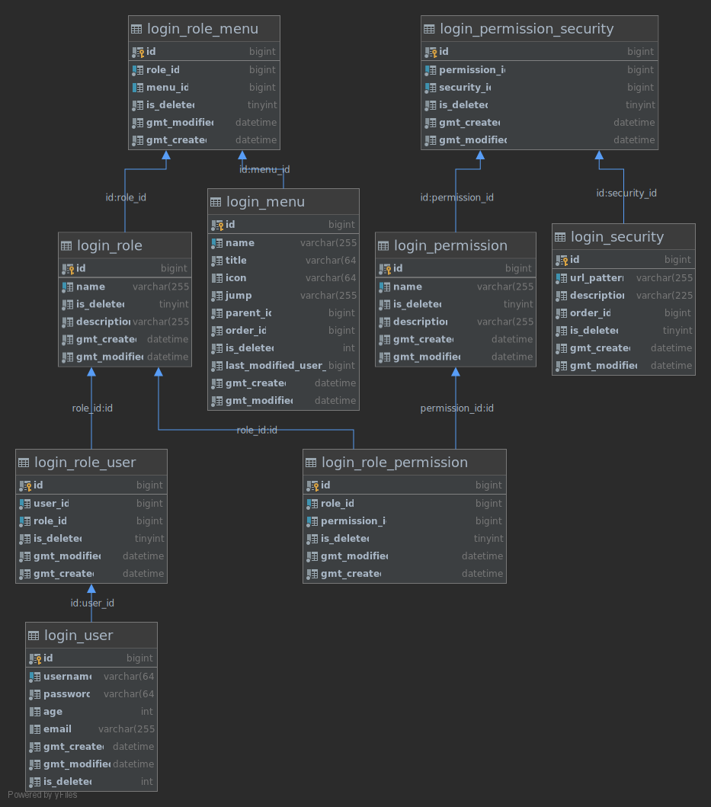

# 权限管理

## 数据表

| 中文              | 表名                        |
| ----------------- | --------------------------- |
| 用户表            | `login_user`                |
| 角色表            | `login_role`                |
| 接口表            | `login_security`            |
| 用户角色关系表    | `login_role_user`           |
| 角色权限组关系表  | `login_role_permission`     |
| 权限组-接口关系表 | `login_permission_security` |
| 权限组表          | `login_permission`          |
| 菜单表            | `login_menu`                |
| 角色菜单关系表    | `login_role_menu`           |


- 权限表 url 集合，一组 URL 的集合

- 链接表，一系列链接的集合（可以看作是资源）


------

```bash
                 用户表
                 
                  关联

                                 （理解这一套链接）
菜单 <--------->   角色  <-------->    权限组  <---------> 链接
         关联表              关联表            关联表

```


## ER 关系


